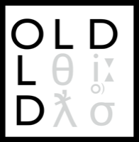

================================================================================
  The Online Linguistic Database (OLD)
================================================================================

The Online Linguistic Database (OLD) is software for linguistic fieldwork. It
helps groups of linguists, language documenters, and/or language community
members to collaboratively build a web-accessible database of their language
data.

For detailed information, see the `OLD Web Site`_ or the `Official OLD
Documentation`_.

Dative_ is a GUI for the OLD. See the `Dative source code`_, `Dative's web
site`_, or the `Dative app`_ for more information.

Features
================================================================================

- Collaboration and data sharing
- Advanced search
- Automatic morpheme cross-referencing
- Configurable validation
- Morphological parser & phonology builder
- Text creation
- User access control
- Documentation
- Open source
- Graphical User Interface: Dative
- RESTful JSON API

Technical
================================================================================

The OLD is software for creating RESTful web services that send and receive
data in JSON format. It is written in Python using the `Pylons web framework`_
and a MySQL database.

.. _`OLD Web Site`: http://www.onlinelinguisticdatabase.org/
.. _`Official OLD Documentation`: http://online-linguistic-database.readthedocs.org/en/latest/
.. _Dative: http://www.dative.ca/
.. _`Dative source code`: https://github.com/jrwdunham/dative/
.. _`Dative's web site`: http://www.dative.ca/
.. _`Dative app`: http://app.dative.ca/
.. _`Pylons web framework`: http://www.pylonsproject.org/projects/pylons-framework/about

